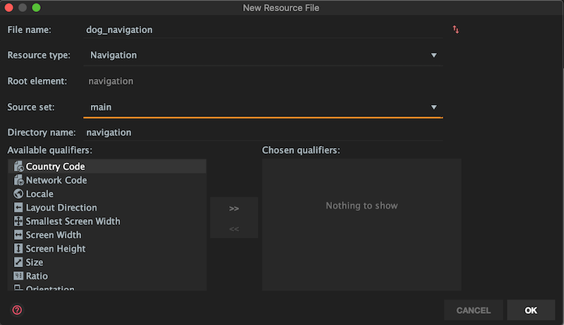

## MVVM Architecture
Create MVVN folder structure by adding new packages for `model`, `view`, and `viewmodel`. Refactor `MainActivity.kt` to the `view` package. File structure should be as follows:

```
com.thomasphillips3.dogs
└───model
└───view
│   │   MainActivity.kt
└───viewmodel
```

## Create list and detail fragments
Right-click the `view` package and add `listFragment` and `detailFragment` as empty Fragments. 


```
com.thomasphillips3.dogs
└───model
└───view
│   │   detailFragment.xml
│   │   listFragment.xml
│   │   MainActivity.kt
└───viewmodel
```

##  Fragment List
In `fragment_list.xml` and `fragment_detail.xml`, add a `layout` tag as the root, and remove the `TextView`

```
<?xml version="1.0" encoding="utf-8"?>
<layout xmlns:android="http://schemas.android.com/apk/res/android"
    xmlns:tools="http://schemas.android.com/tools">
    <FrameLayout
        android:layout_width="match_parent"
        android:layout_height="match_parent"
        tools:context=".view.nameOfFragment">
        
    </FrameLayout>
</layout>
```

## Create the Navigation Graph

Right-click `res` folder and add a new Android Resource File named `dog_navigation` with `Navigation` for the `Resource type`



Add `listFragment` and `detailFragment` as Navigation destinations. Create actions between the two of them, and change the action IDs to `actionDetailFragment` and `actionListFragment`. The Navigation Graph should be as follows:


## Add NavHostFragment
In `activity_main.xml`, add the following within the root `ConstraintLayout` tag, with constraints

```    
<fragment
    android:id="@+id/fragment"
    android:name="androidx.navigation.fragment.NavHostFragment"
    android:layout_width="0dp"
    android:layout_height="0dp"
    android:layout_marginStart="1dp"
    android:layout_marginLeft="1dp"
    android:layout_marginTop="1dp"
    android:layout_marginEnd="1dp"
    android:layout_marginRight="1dp"
    android:layout_marginBottom="1dp"
    app:defaultNavHost="true"
    app:layout_constraintBottom_toBottomOf="parent"
    app:layout_constraintEnd_toEndOf="parent"
    app:layout_constraintStart_toStartOf="parent"
    app:layout_constraintTop_toTopOf="parent"
    app:navGraph="@navigation/dog_navigation" />
```

## List Fragment UI
* Replace `FrameLayout` with `ConstraintLayout`
* Add a `TextView` and constrain it on all sides
* Create a new `Vector Asset` for the details Floating Action Button (FAB)


* Add a FAB to the layout, using the `ic_detail` vector asset. Constrain the right and bottom of the FAB to its parent

`fragment_list.xml` should look like this
```
<?xml version="1.0" encoding="utf-8"?>
<layout xmlns:android="http://schemas.android.com/apk/res/android"
    xmlns:app="http://schemas.android.com/apk/res-auto"
    xmlns:tools="http://schemas.android.com/tools">
    <androidx.constraintlayout.widget.ConstraintLayout
        android:layout_width="match_parent"
        android:layout_height="match_parent"
        tools:context=".view.listFragment">

        <TextView
            android:text="List Fragment"
            android:id="@+id/textView"
            android:layout_width="wrap_content"
            android:layout_height="wrap_content"
            app:layout_constraintBottom_toBottomOf="parent"
            app:layout_constraintEnd_toEndOf="parent"
            app:layout_constraintStart_toStartOf="parent"
            app:layout_constraintTop_toTopOf="parent" />

        <com.google.android.material.floatingactionbutton.FloatingActionButton
            android:id="@+id/floatingActionButton"
            android:layout_width="wrap_content"
            android:layout_height="wrap_content"
            android:clickable="true"
            android:src="@drawable/ic_detail"
            app:layout_constraintBottom_toBottomOf="parent"
            app:layout_constraintEnd_toEndOf="parent" />
    </androidx.constraintlayout.widget.ConstraintLayout>
</layout>
```

## Detail Fragment UI
* Perform the same steps as [List Fragment UI](#list-fragment-ui), but use an `ic_list` vector asset


`detail_fragment.xml` should look like this
```
<?xml version="1.0" encoding="utf-8"?>
<layout xmlns:android="http://schemas.android.com/apk/res/android"
    xmlns:app="http://schemas.android.com/apk/res-auto"
    xmlns:tools="http://schemas.android.com/tools">
    <androidx.constraintlayout.widget.ConstraintLayout
        android:layout_width="match_parent"
        android:layout_height="match_parent"
        tools:context=".view.detailFragment">

        <TextView
            android:text="Detail Fragment"
            android:id="@+id/textView"
            android:layout_width="wrap_content"
            android:layout_height="wrap_content"
            app:layout_constraintBottom_toBottomOf="parent"
            app:layout_constraintEnd_toEndOf="parent"
            app:layout_constraintStart_toStartOf="parent"
            app:layout_constraintTop_toTopOf="parent" />

        <com.google.android.material.floatingactionbutton.FloatingActionButton
            android:id="@+id/floatingActionButton"
            android:layout_width="wrap_content"
            android:layout_height="wrap_content"
            android:clickable="true"
            android:src="@drawable/ic_list"
            app:layout_constraintBottom_toBottomOf="parent"
            app:layout_constraintEnd_toEndOf="parent" />
    </androidx.constraintlayout.widget.ConstraintLayout>
</layout>
```

## Navigation Functionality

Passing data between destinations.

* Give IDs to both FABs - `buttonDetail` in `fragment_list.xml` and `buttonList` in `fragment_detail.xml`
* Override `onViewCreated` in `listFragment.kt`

```
override fun onViewCreated(view: View, savedInstanceState: Bundle?) {
    super.onViewCreated(view, savedInstanceState)

    buttonDetail.setOnClickListener {
        val action = listFragmentDirections.actionDetailFragment()
        Navigation.findNavController(it).navigate(action)
    }
}
```

* Override `onViewCreated` in `detailFragment.kt`

```
override fun onViewCreated(view: View, savedInstanceState: Bundle?) {
    super.onViewCreated(view, savedInstanceState)
    
    buttonList.setOnClickListener {
        val action = detailFragmentDirections.actionListFragment()
        Navigation.findNavController(it).navigate(action)
    }
}
```

## Create Back Button
* Create a nav controller
* Set up action bar with nav controller
* Override `onSupportNavigateUp`

`MainActivity.kt` should look like:

```
class MainActivity : AppCompatActivity() {

    private lateinit var navController: NavController

    override fun onCreate(savedInstanceState: Bundle?) {
        super.onCreate(savedInstanceState)
        setContentView(R.layout.activity_main)

        navController = Navigation.findNavController(this, R.id.fragment)
        NavigationUI.setupActionBarWithNavController(this, navController)
    }

    override fun onSupportNavigateUp(): Boolean {
        return NavigationUI.navigateUp(navController, null)
    }
}
```

## Arguments and Animations

* Create a `dogUuid` argument on the `detailFragment` in `dog_navigation.xml`. Under the `actionListFragment` add

```
<argument
    android:name="dogUuid"
    android:defaultValue="0"
    app:argType="integer" />
```

Since we changed an xml file, clean and rebuild the projet. After rebuilding, the `action` object now has a `dogUuid` property, which takes integer values.