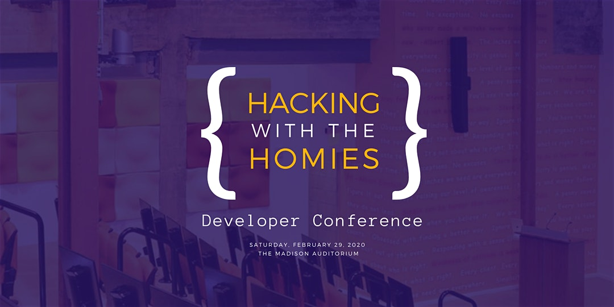

## GoLang
> Bryan Campbell
> @Diverious

`chan` —> Channels allow threads to speak to one another

**Testing in Go**
* Documentation can run tests

**Questions**
* Example of importing from GH?
* Set up in VS Code

## DevOps
> Brianna McCullough
> @BriLimitless

Ansible - Configuration tool that allows infrastructure as code (IAC) in Python

Ansible Playbook - list of tasks to do for configuration of a system

**Questions**
* Simple web server with load balancer example?
* Can you use Ansible with any platform? (i.e AWS, GCS, Digital Ocean, etc)

## Blockchain/ Solidity
> Briant Anthony
> @AceAnthony

* [Ethereum App Demo](https://github.com/BriantAnthony/ethereum-dapp-demo)
* Use Truffle to compile and deploy to a local blockchain

## AI

> Jeseekia Vaughn
> @MetaDevGirl

Supervised learning - create a model that can accept inputs and predict something

* Is there an industry-standard minimum amount of data for training a model?

## Digital Identity
> Andrew Cameron
> @cameronka

**Steps**
* Create a web app
* Configure sec model
* Review login experience
* Examine sec token

## Add AI to Automated Tests
> Angie Jones
> @techgirl1908

* Do the tests get smarter over time? Is the model trained on the passing screenshots?
* Web only, or is native supported as well?

## Kubernetes
> Ofiliojo Ichaba
> @ofiliojo
